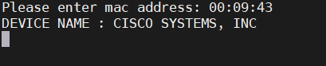

## BINTU APP

This is a small app for quickly retrieving the MAC address of a device. 
The app uses the `https://macvendors.com` API to fetch the required MAC address information. 
Users can use the app in two forms:
+ CMD type: A command-line interface for obtaining MAC addresses.
+ WEB type: A web interface for checking MAC addresses."

## CMD 
In the CMD type, when you run the APP for the first time, it ask you to setup a name for your comapny. 

After the up your company name, the APP start for you.

Type in the mac address of the device you want to check.

You can stop or close the APP by typing [x].

# NOTE
Visit Macvendors [macvendors](https://macvendors.com/api) and register for an API. 
After registering, you will be provided with your bearer token. 
You can then use the APP. 

### Note that both the cmd and web are all written in pure python.
